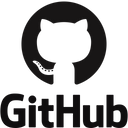

### 👋 Hello, I'm Chris!
I am a junior at Wentworth Institute of Technology that is studying Computer Science and Business Management. I love working with people on projects, and my goal is to become a full-fledged Software Developer. Thanks for checking me out!

 

## Experience Using

 

## Currently Learning

 

## Projects I've Worked On
- [ML Pong Player][pongplayer] - A simple linear regression machine learning model that learns how to play Pong
- [Online Trivia Game][triviaduel] - A Java-based online trivia game that features lobbies and realtime trivia gameplay
- [ML Plastic Pollution Predictor][plasticpredictor] - A simple linear regression machine learning model that predicts plastic waste contribution of theoretical country
- [AppliTrack][applitrack] - A web app that lets you keep track of your job search

[pongplayer]: https://github.com/dentremontcatwit/pongplayer
[triviaduel]: https://github.com/madeiragatwit/TriviaDuelProject
[plasticpredictor]: https://github.com/dentremontcatwit/plasticpollution
[applitrack]: https://github.com/dentremontcatwit/AppliTrack
